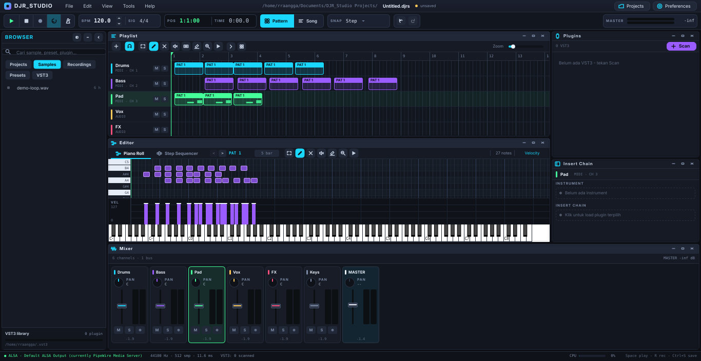
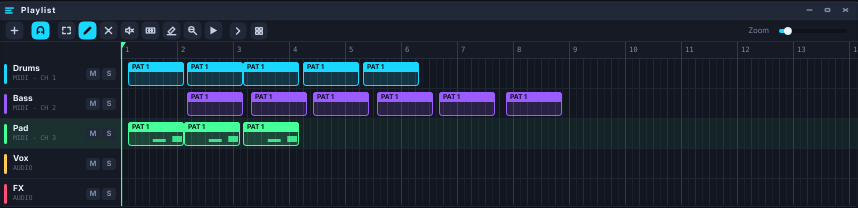
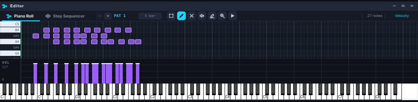

# DJR_Studio

DAW native Linux berbasis C++20, JUCE 8, dan CMake. MIDI, audio, VST3, mixer,
piano roll, dan step sequencer dalam satu shell panel mengambang ala FL Studio.

> **Status: beta.** Sudah bisa dipakai membuat pattern, merekam, dan meng-export
> WAV, tapi belum ada automation dan belum diuji di banyak distro. Simpan
> pekerjaan pentingmu sesering mungkin.



## Yang sudah jalan

**Playlist / arrangement**



- Delapan tool ala FL: Select (marquee, geser & hapus grup), Paint (sapuan
  clip, otomatis dipotong agar pas mengisi celah), Delete, Mute, Slip, Slice
  (dengan garis pratinjau), Zoom, Playback.
- Clip audio bisa digeser, di-trim, dipotong, dan di-warp mengikuti tempo.
- Tinggi tiap lane bisa ditarik sendiri-sendiri.
- Pattern bisa diberi nama; satu pattern bisa ditempatkan berkali-kali dengan
  potongan berbeda tanpa mengubah patternnya.
- Playlist selalu menampilkan penempatan pattern — tombol Pattern/Song hanya
  menentukan apa yang diputar, seperti FL.

**Piano roll & step sequencer**



- Tujuh tool: Select (marquee note, geser & hapus grup), Draw (sapuan note),
  Delete, Mute, Slice, Zoom, Playback.
- Velocity lane, keyboard on-screen untuk audisi tanpa hardware MIDI.
- Step sequencer 4 lane drum yang menulis note sungguhan ke clip yang sama —
  satu halaman = satu bar, jadi 16 pad di 4/4 dan 12 pad di 3/4.

**Engine**

- Audio engine realtime-safe: tidak ada alokasi, file I/O, atau lock yang
  memblokir di audio callback.
- Instrument & efek VST3, dengan state parameter ikut tersimpan ke project.
- Recording audio (WAV) dan MIDI, dengan metronome dan count-in.
- Time signature 4/4 sampai 12/8.
- Undo/redo 64 langkah untuk semua edit clip dan note.
- Export WAV offline, lebih cepat dari realtime.

## Yang belum ada

Automation lane, send/bus routing di mixer, freeze/bounce track, plugin delay
compensation, dan time-stretch yang mempertahankan pitch (warp saat ini memakai
resampling, jadi pitch ikut bergeser saat tempo berubah).

## Install dari `.deb`

```bash
sudo apt install ./djr-studio-0.2.0-beta-Linux.deb
```

Jalankan lewat menu aplikasi (**DJR_Studio**) atau dari terminal:

```bash
djr_studio
```

Uninstall:

```bash
sudo apt remove djr-studio
```

## Build dari sumber

Dependency (Debian/Ubuntu):

```bash
sudo apt update
sudo apt install -y build-essential cmake git pkg-config libasound2-dev libjack-jackd2-dev libfreetype6-dev libx11-dev libxext-dev libxinerama-dev libxcursor-dev libxrandr-dev libgl1-mesa-dev libcurl4-openssl-dev
```

Build dan jalankan:

```bash
cmake -S . -B build -DCMAKE_BUILD_TYPE=Release
cmake --build build -j$(nproc)
./build/djr_studio_artefacts/Release/djr_studio
```

JUCE diambil otomatis lewat `FetchContent`, jadi tidak perlu di-clone terpisah.

Bikin paket `.deb`:

```bash
cd build && cpack -G DEB
```

Cara cepat, memakai script yang sudah disediakan:

```bash
./scripts/run-local.sh
./scripts/reinstall-deb.sh
```

## Test

```bash
cmake -S . -B build-debug -DDJR_STUDIO_BUILD_TESTS=ON
cmake --build build-debug -j$(nproc)
ctest --test-dir build-debug --output-on-failure
```

`djr_studio_engine_tests` menjalankan mixer secara offline tanpa audio device:
memuat VST3 asli dari mesin untuk membuktikan insert effect tidak membisukan
track, merekam WAV lalu membacanya kembali, memeriksa undo/redo, time signature,
metronome, dan round-trip project.

## Versi

Versi dibentuk otomatis saat configure: bagian angka dari `DJR_VERSION_BASE` di
`CMakeLists.txt`, sisanya dari `git describe`. Binary hasil build selalu bisa
dilacak balik ke commit asalnya — lihat **Help → About**.

Paket Debian memakai `0.2.0~beta`; tilde membuatnya diurutkan *di bawah* `0.2.0`,
sehingga rilis stabil nanti terdeteksi sebagai upgrade.

## Struktur

| Folder | Isi |
|---|---|
| `src/app` | bootstrap JUCE, window, session state, undo history |
| `src/audio` | engine, transport, track, mixer, clip audio, metronome |
| `src/midi` | MIDI input, note model, clip, piano roll model |
| `src/plugins` | scanner VST3, manager, chain, jendela editor plugin |
| `src/recording`, `src/export`, `src/project` | rekam, render offline, file `.djrs` |
| `src/ui` | seluruh komponen GUI |
| `tests` | test engine offline |

## Troubleshooting

**Tidak ada suara.** Buka **Tools → Audio Device Settings** dan pastikan device
output benar. Untuk PipeWire, pastikan `pipewire-audio` dan `pipewire-jack`
terpasang.

**VST3 tidak terdeteksi.** Plugin harus ada di `~/.vst3`, `/usr/lib/vst3`, atau
`/usr/local/lib/vst3`, lalu jalankan **Tools → Scan VST3 Plugins**. VST2 tidak
didukung.

**Linker error JUCE setelah ganti build type.** Hapus folder build lama sekali:

```bash
rm -rf build build-debug build-release
```

## Lisensi

Lihat [LICENSE](LICENSE).
